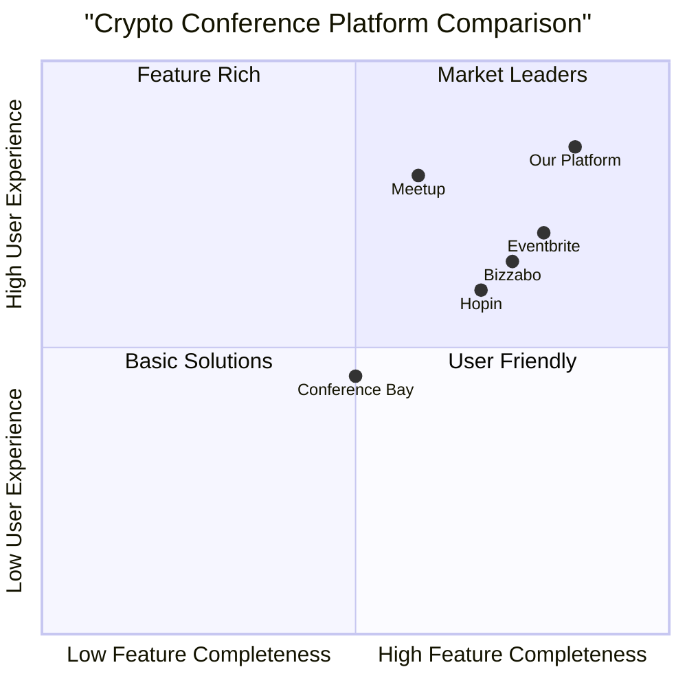

# Crypto Conference Sponsorship Platform PRD

## 1. Project Overview

### 1.1 Project Description
A bilingual (Chinese/English) web platform connecting crypto conference organizers with potential sponsors, streamlining the sponsorship process through an intuitive interface.

### 1.2 Project Goals
- Create a centralized platform for crypto conference sponsorship management
- Streamline the sponsorship process from discovery to booking
- Enable efficient event management for conference organizers

### 1.3 User Stories
- As a sponsor, I want to browse and filter crypto conferences so that I can find relevant sponsorship opportunities
- As a sponsor, I want to select multiple sponsorship packages and schedule meetings easily
- As an organizer, I want to list my conference and manage sponsorship packages efficiently

## 2. Product Features

### 2.1 Core Features

#### 2.1.1 Entry Page
**Must Have:**
- Email-based login system
- Role selection (Sponsor/Organizer)
- Language switch button (Chinese/English)

#### 2.1.2 Sponsor Interface
**Must Have:**
- Conference listing with multi-dimensional filters:
  - Time period (e.g., 2025 Q1, Q2)
  - Region
  - Track
  - Tags
  - Conference names (e.g., Consensus, TOKEN2049)
- Conference details display:
  - Sponsorship menu (e.g., "$5K - Logo Display", "$10K - Speaking Opportunity")
  - Side events listing with tags
  - Individual sponsorship options for each side event
- Shopping cart system:
  - Single cart instance
  - Multiple package selection (booth, backdrop, logo display, speaking slot)
  - Direct integration with meeting scheduling

#### 2.1.3 Organizer Interface
**Must Have:**
- Event submission form:
  - Basic info (name, date, region, track)
  - Deck and cover photo upload
  - Dynamic sponsorship package creation
- Dashboard:
  - Event details and sponsorship status
  - Confirmed sponsorships
  - Pending meetings
  - Available packages

### 2.2 Technical Requirements

#### 2.2.1 Frontend Implementation
**Must Have:**
- React.js with Tailwind CSS
- Responsive design
- Real-time filter functionality
- Integrated calendar system

#### 2.2.2 Backend API Requirements
**Must Have:**
```
GET /events
GET /sponsor-options
POST /event
POST /cart
POST /meeting-booking
```

## 3. Competitive Analysis



## 4. Requirements Pool

### P0 (Must Have)
- Email-based authentication
- Role-based access control
- Bilingual support
- Conference listing with filters
- Sponsorship package management
- Shopping cart functionality
- Meeting scheduling system

### P1 (Should Have)
- Real-time availability updates
- Integration with Google Calendar/Calendly
- Automated email notifications
- Analytics dashboard for organizers

### P2 (Nice to Have)
- Advanced analytics
- Payment integration
- Mobile app
- Geographic visualization

## 5. UI Design Draft

### 5.1 Entry Page Layout
```
+------------------+
|   Language Switch|
+------------------+
|                  |
|    Email Login   |
|                  |
+------------------+
|   Role Selection |
| [Sponsor][Org]   |
+------------------+
```

### 5.2 Sponsor Dashboard
```
+------------------+
|Filter Bar        |
+------------------+
|Conference List   |
|  - Name          |
|  - Date          |
|  - Location      |
|  - Packages      |
+------------------+
|Shopping Cart     |
+------------------+
```

## 6. Open Questions

1. Payment Processing
   - Which payment methods should be supported?
   - How to handle different currencies?

2. Technical Integration
   - Specific calendar system integration details
   - Data synchronization mechanism

3. Scalability
   - How to handle concurrent users?
   - Database optimization strategies

## 7. Success Metrics

1. User Engagement
   - Number of registered organizers
   - Number of registered sponsors
   - Average session duration

2. Business Metrics
   - Number of successful sponsorship deals
   - Platform utilization rate
   - Meeting conversion rate

3. Technical Metrics
   - System uptime
   - Response time
   - Error rate