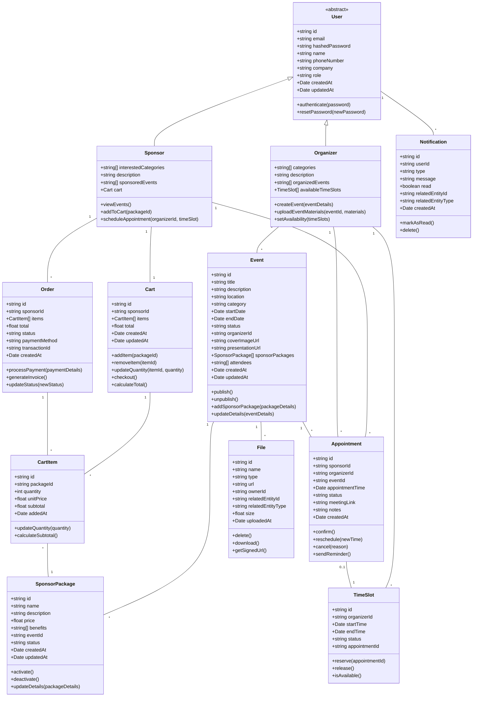
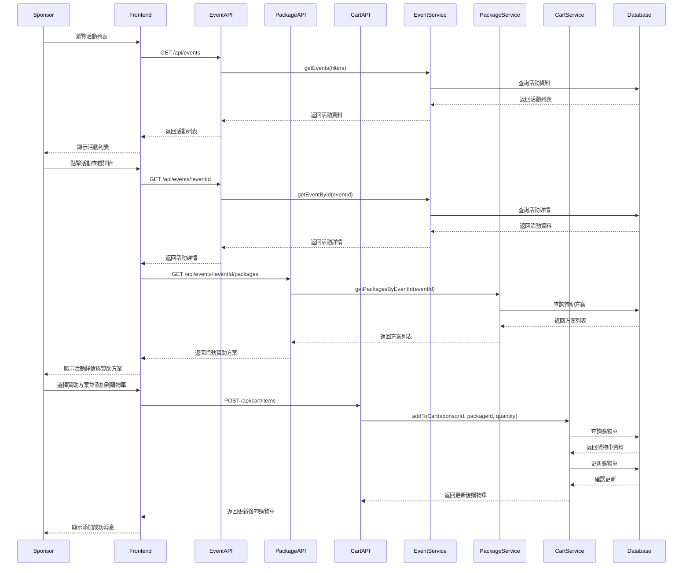
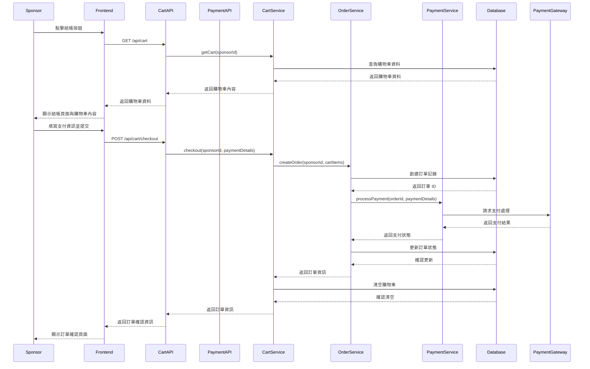
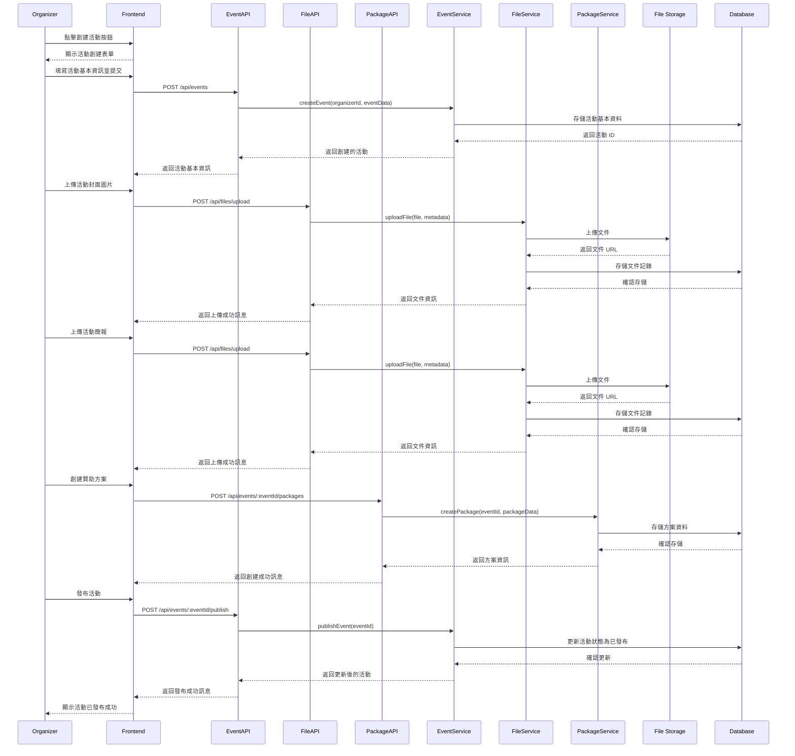
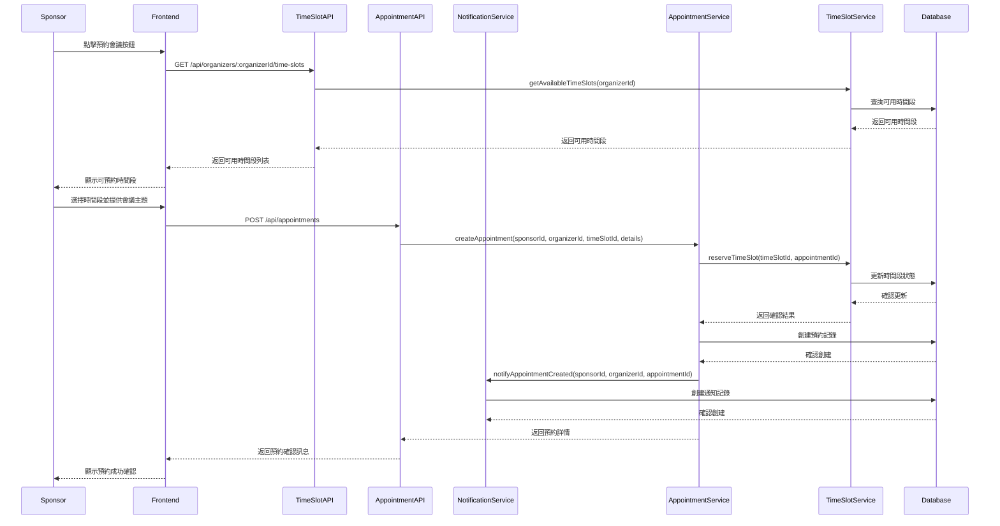

# 活動管理平台系統設計

## 實作方向

基於PRD的需求分析，我們將設計一個彈性且可擴展的系統架構，主要關注於贊助方和主辦方的核心功能。以下是主要實作方向：

### 1. 系統架構選擇

我們將採用現代化的前後端分離架構：
- **前端**: React + TypeScript + Tailwind CSS
  - 響應式設計確保在不同裝置上的良好體驗
  - 組件化開發提高代碼復用性
- **後端**: Node.js (Express) + TypeScript
  - RESTful API 設計
  - GraphQL 考慮用於複雜數據查詢場景
- **資料庫**: 
  - MongoDB 作為主要數據庫（適合靈活的文檔結構）
  - Redis 用於緩存和會話管理
- **檔案存儲**: AWS S3 或類似雲存儲服務，用於存儲活動封面照片和簡報文件
- **身份認證**: JWT (JSON Web Tokens) + OAuth 2.0 支持第三方登入

### 2. 關鍵技術選擇與難點解決

#### 檔案上傳與管理
- 使用 Multer 處理文件上傳
- 集成 AWS S3 SDK 進行雲端存儲
- 實現文件類型驗證、大小限制和安全掃描

#### 會議預約系統
- 整合 Google Calendar API 或 Calendly API
- 自建會議時間槽管理系統
- 實現自動化的會議通知和提醒機制

#### 購物車與支付處理
- 使用 Stripe 或 PayPal 處理支付
- 實現購物車狀態管理和存儲
- 建立完整的訂單生命週期管理

#### 系統整合
- 設計兼容性API層處理舊系統數據
- 實現數據遷移工具
- 提供版本轉換的中間件

### 3. 系統模塊劃分

系統將劃分為以下主要模塊：

1. **用戶管理模塊**：註冊、登入、資料管理，權限控制
2. **活動管理模塊**：創建、編輯、發布活動及管理活動詳情
3. **贊助方案模塊**：管理各種贊助方案及其細節
4. **檔案管理模塊**：處理上傳、存儲和檢索文檔和圖片
5. **購物車與支付模塊**：管理購物車和處理支付
6. **會議預約模塊**：管理會議時間槽和預約
7. **通知系統模塊**：處理系統內的通知和提醒
8. **報表與分析模塊**：提供數據統計和分析功能

## 數據結構與接口

系統的核心數據結構設計如下，按照物件關係對系統中的主要實體進行建模：



## API 設計

以下是系統的主要 API 端點設計：

### 用戶管理 API

```typescript
interface UserAPI {
  // 註冊新用戶
  POST /api/users/register: (userData: UserRegisterDTO) => User;
  
  // 用戶登入
  POST /api/users/login: (credentials: LoginDTO) => { user: User, token: string };
  
  // 取得用戶資料
  GET /api/users/profile: (headers: AuthHeader) => User;
  
  // 更新用戶資料
  PUT /api/users/profile: (userData: UserUpdateDTO, headers: AuthHeader) => User;
  
  // 重設密碼
  POST /api/users/reset-password: (data: PasswordResetDTO) => { success: boolean };
}
```

### 活動管理 API

```typescript
interface EventAPI {
  // 創建新活動
  POST /api/events: (eventData: EventCreateDTO, headers: AuthHeader) => Event;
  
  // 更新活動資料
  PUT /api/events/:eventId: (eventData: EventUpdateDTO, headers: AuthHeader) => Event;
  
  // 取得活動列表（含篩選及分頁）
  GET /api/events: (query: EventFilterQuery) => { events: Event[], total: number, page: number, limit: number };
  
  // 取得單一活動詳情
  GET /api/events/:eventId: () => Event;
  
  // 發布活動
  POST /api/events/:eventId/publish: (headers: AuthHeader) => Event;
  
  // 取消發布活動
  POST /api/events/:eventId/unpublish: (headers: AuthHeader) => Event;
  
  // 刪除活動
  DELETE /api/events/:eventId: (headers: AuthHeader) => { success: boolean };
}
```

### 贊助方案 API

```typescript
interface SponsorPackageAPI {
  // 創建贊助方案
  POST /api/events/:eventId/packages: (packageData: PackageCreateDTO, headers: AuthHeader) => SponsorPackage;
  
  // 更新贊助方案
  PUT /api/packages/:packageId: (packageData: PackageUpdateDTO, headers: AuthHeader) => SponsorPackage;
  
  // 取得活動的所有贊助方案
  GET /api/events/:eventId/packages: () => SponsorPackage[];
  
  // 取得單一贊助方案詳情
  GET /api/packages/:packageId: () => SponsorPackage;
  
  // 刪除贊助方案
  DELETE /api/packages/:packageId: (headers: AuthHeader) => { success: boolean };
}
```

### 購物車 API

```typescript
interface CartAPI {
  // 取得購物車內容
  GET /api/cart: (headers: AuthHeader) => Cart;
  
  // 加入購物車
  POST /api/cart/items: (data: { packageId: string, quantity: number }, headers: AuthHeader) => Cart;
  
  // 更新購物車項目數量
  PUT /api/cart/items/:itemId: (data: { quantity: number }, headers: AuthHeader) => Cart;
  
  // 移除購物車項目
  DELETE /api/cart/items/:itemId: (headers: AuthHeader) => Cart;
  
  // 清空購物車
  DELETE /api/cart/items: (headers: AuthHeader) => { success: boolean };
  
  // 結帳
  POST /api/cart/checkout: (paymentData: PaymentDTO, headers: AuthHeader) => Order;
}
```

### 檔案管理 API

```typescript
interface FileAPI {
  // 上傳檔案
  POST /api/files/upload: (file: File, data: FileMetadata, headers: AuthHeader) => File;
  
  // 取得活動相關檔案
  GET /api/events/:eventId/files: (headers: AuthHeader) => File[];
  
  // 取得檔案下載連結
  GET /api/files/:fileId/download: (headers: AuthHeader) => { url: string };
  
  // 刪除檔案
  DELETE /api/files/:fileId: (headers: AuthHeader) => { success: boolean };
}
```

### 會議預約 API

```typescript
interface AppointmentAPI {
  // 主辦方設定可用時間段
  POST /api/time-slots: (data: TimeSlotCreateDTO[], headers: AuthHeader) => TimeSlot[];
  
  // 取得主辦方可用時間段
  GET /api/organizers/:organizerId/time-slots: (query: TimeSlotFilterQuery) => TimeSlot[];
  
  // 預約會議
  POST /api/appointments: (data: AppointmentCreateDTO, headers: AuthHeader) => Appointment;
  
  // 取得用戶相關的預約會議
  GET /api/appointments: (headers: AuthHeader) => Appointment[];
  
  // 更新會議狀態（確認/取消/重新安排）
  PUT /api/appointments/:appointmentId: (data: AppointmentUpdateDTO, headers: AuthHeader) => Appointment;
}
```

## 程式呼叫流程

以下是系統中主要用戶操作的序列圖：

### 1. 贊助商瀏覽活動與添加贊助方案到購物車



### 2. 贊助商結帳流程



### 3. 主辦方創建活動流程



### 4. 贊助商預約會議流程



## 整合策略

### 與前一版本的整合方案

基於PRD中提到的整合要點，我們提出以下具體整合策略：

#### 1. API 兼容層

- 創建API兼容層，用於處理舊版API請求，並轉換為新版API格式
- 將舊版接口路由到新系統的對應功能
- 實現數據轉換邏輯，確保請求/響應格式一致性

#### 2. 數據遷移

- 設計數據遷移腳本，將舊版數據庫結構轉換為新版格式
- 提供增量同步機制，確保過渡期間數據一致性
- 建立數據驗證機制，確保遷移數據的完整性和正確性

#### 3. 用戶身份整合

- 保留原有用戶身份認證系統，同時實現與新系統的單點登入
- 擴展用戶模型以支持新功能需求
- 確保用戶數據安全，特別是在遷移過程中

#### 4. 前端整合

- 採用漸進式遷移策略，逐步將舊UI組件替換為新組件
- 使用共享設計系統確保UI/UX一致性
- 實現特性切換機制，允許逐步啟用新功能

## 未明確事項

根據PRD中提到的開放問題，以下幾個方面需要進一步澄清：

1. **舊版本功能範圍**
   - 需要更詳細了解舊版本的具體功能及數據結構
   - 確認是否需要實現向後兼容，以及兼容的時間範圍

2. **支付系統需求**
   - 需要確認支援的貨幣類型
   - 確定首選的支付提供商（Stripe, PayPal等）
   - 了解發票生成的具體要求

3. **會議系統整合詳情**
   - 確定是使用第三方會議系統還是自建系統
   - 如果使用第三方系統，需確認具體選擇(Zoom, Google Meet等)
   - 明確會議預約的自動化需求（提醒機制、行事曆同步等）

4. **檔案管理需求細節**
   - 確認上傳文件的大小限制
   - 確定支持的文件類型
   - 明確檔案存儲安全性要求
   - 確定是否需要文件預覽功能

5. **報表與分析需求**
   - 確認需要提供哪些分析數據與報表
   - 了解數據展示的偏好方式（圖表類型、匯出格式等）

## 結論

本系統設計文檔提供了活動管理平台的詳細架構設計，包括實作方向、數據結構、API設計和程式呼叫流程。該設計充分考慮了PRD中定義的所有核心功能需求，並提出了與前一版本的整合策略。

透過採用現代化的技術架構和模塊化設計，該平台將能夠為贊助方和主辦方提供流暢且功能完整的使用體驗。設計著重於系統的擴展性和可維護性，確保平台能夠在未來根據需要輕鬆添加新功能或進行調整。