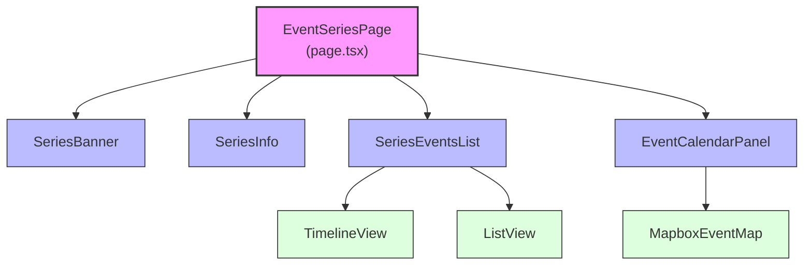
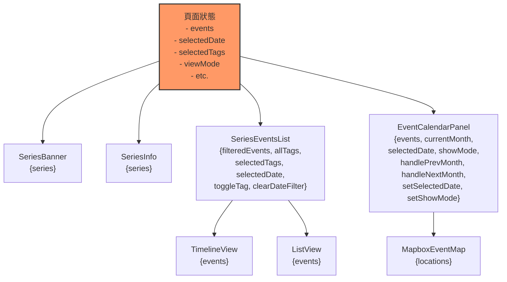
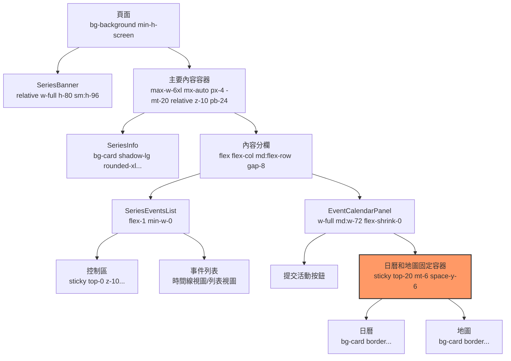

# 事件系列頁面組件結構圖

下面的圖表展示了事件系列頁面組件的層次結構：

```mermaid
graph TD
    Page["EventSeriesPage<br/>(page.tsx)"] --> A["SeriesBanner"]
    Page --> B["SeriesInfo"]
    Page --> C["SeriesEventsList"]
    Page --> D["EventCalendarPanel"]
    
    C --> C1["TimelineView"]
    C --> C2["ListView"]
    
    D --> D1["MapboxEventMap"]
    
    style Page fill:#f9f,stroke:#333,stroke-width:2px
    style A fill:#bbf,stroke:#333,stroke-width:1px
    style B fill:#bbf,stroke:#333,stroke-width:1px
    style C fill:#bbf,stroke:#333,stroke-width:1px
    style D fill:#bbf,stroke:#333,stroke-width:1px
    
    style C1 fill:#dfd,stroke:#333,stroke-width:1px
    style C2 fill:#dfd,stroke:#333,stroke-width:1px
    style D1 fill:#dfd,stroke:#333,stroke-width:1px
```

## 數據流概覽

```mermaid
flowchart TD
    A["頁面狀態<br/>- events<br/>- selectedDate<br/>- selectedTags<br/>- viewMode<br/>- etc."] --> B["SeriesBanner<br/>{series}"]
    A --> C["SeriesInfo<br/>{series}"]
    
    A --> D["SeriesEventsList<br/>{filteredEvents, allTags,<br/>selectedTags, selectedDate,<br/>toggleTag, clearDateFilter}"]
    D --> D1["TimelineView<br/>{events}"]
    D --> D2["ListView<br/>{events}"]
    
    A --> E["EventCalendarPanel<br/>{events, currentMonth,<br/>selectedDate, showMode,<br/>handlePrevMonth, handleNextMonth,<br/>setSelectedDate, setShowMode}"]
    E --> E1["MapboxEventMap<br/>{locations}"]
    
    style A fill:#f96,stroke:#333,stroke-width:2px
```

## 關鍵布局設計

```mermaid
graph TD
    A["頁面<br/>bg-background min-h-screen"] --> B["SeriesBanner<br/>relative w-full h-80 sm:h-96"]
    A --> C["主要內容容器<br/>max-w-6xl mx-auto px-4 -mt-20 relative z-10 pb-24"]
    
    C --> D["SeriesInfo<br/>bg-card shadow-lg rounded-xl..."]
    C --> E["內容分欄<br/>flex flex-col md:flex-row gap-8"]
    
    E --> F["SeriesEventsList<br/>flex-1 min-w-0"]
    E --> G["EventCalendarPanel<br/>w-full md:w-72 flex-shrink-0"]
    
    F --> H["控制區<br/>sticky top-0 z-10..."]
    F --> I["事件列表<br/>時間線視圖/列表視圖"]
    
    G --> J["提交活動按鈕"]
    G --> K["日曆和地圖固定容器<br/>sticky top-20 mt-6 space-y-6"]
    
    K --> L["日曆<br/>bg-card border..."]
    K --> M["地圖<br/>bg-card border..."]
    
    style K fill:#f96,stroke:#333,stroke-width:2px
``` 