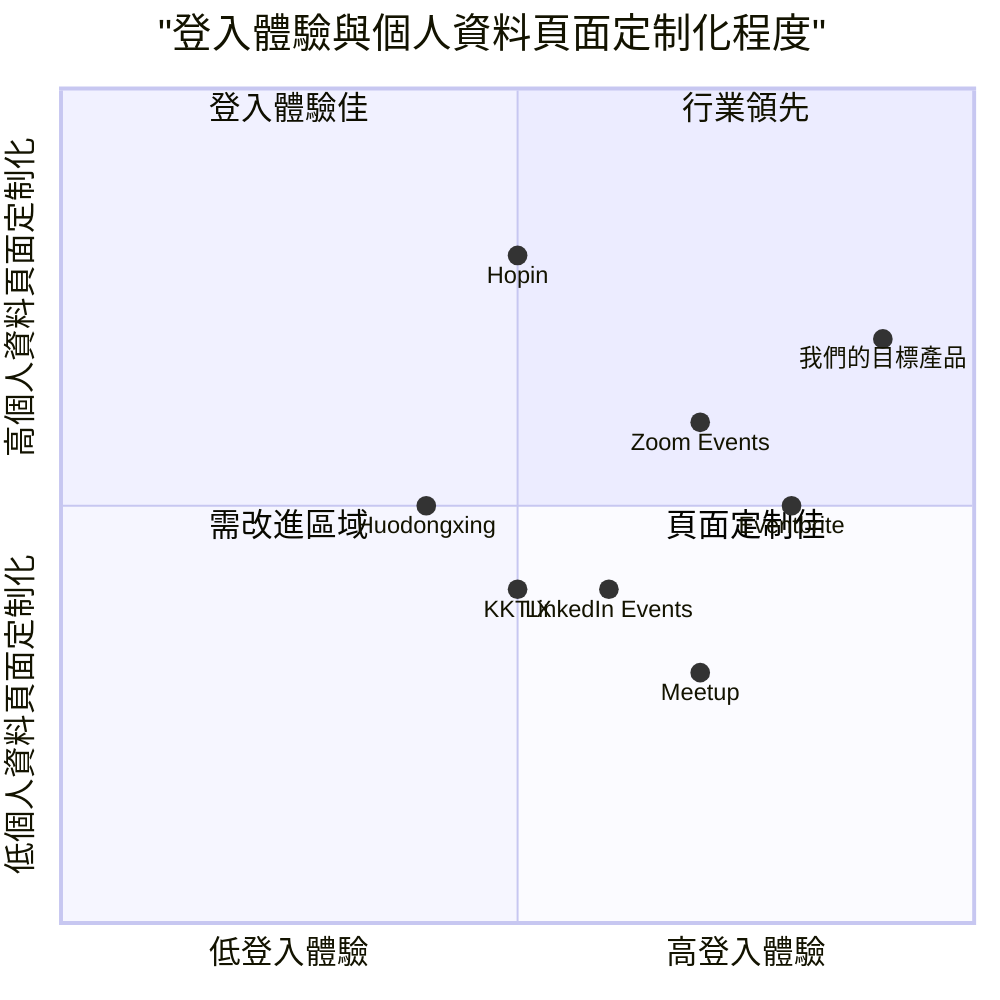

# 產品需求文件 (PRD)：登入系統優化與社交媒體整合

## 專案資訊

- **專案名稱**：login_system_integration
- **文件版本**：1.0
- **最後更新**：2025-03-01

## 原始需求

需要一個登入系統與可以用 Google Mail、Apple ID 登入，一鍵登入功能，在登入頁面上顯示這項功能。登入後，不管是主辦方還是贊助方都擁有自己的 profile。希望保持產品現狀並進行優化，開發一個最小的 MVP，不要太大的更動。

## 1. 產品定義

### 1.1 產品目標

1. **簡化登入流程**：整合 Google 和 Apple ID 登入選項，減少用戶註冊和登入的摩擦。
2. **提升用戶體驗**：為主辦方和贊助方提供個性化的個人資料頁面，滿足各自的需求。
3. **保持系統穩定**：在現有系統基礎上進行最小化改動，確保平台穩定性。

### 1.2 用戶故事

1. **作為一個潛在用戶**，我想要使用我的 Google 帳號一鍵登入平台，這樣我就不需要創建和記住新的帳號密碼。
2. **作為一個活動主辦方**，我想要登入後直接訪問我的個人資料頁面，以便管理我的活動和個人資訊。
3. **作為一個贊助方**，我想要有專屬的個人資料頁面，以便管理我的品牌曝光和贊助活動。
4. **作為一個回訪用戶**，我希望系統記住我的登入狀態，這樣我就不需要每次都重新登入。
5. **作為一個安全意識強的用戶**，我希望能夠輕鬆登出所有裝置，以保護我的帳號安全。

### 1.3 競爭分析

| 競品名稱 | 優點 | 缺點 |
|---------|------|------|
| Eventbrite | 整合多種社交媒體登入選項，UI設計簡潔直觀 | 用戶個人資料頁面功能較為有限，缺乏對贊助方的專屬設計 |
| Meetup | 登入流程簡單，社群功能強大 | 對主辦方和贊助方的區分不明顯，個人資料頁面統一化 |
| Hopin | 主辦方和贊助方有明確角色區分，個人資料頁面針對性強 | 登入選項較少，一鍵登入流程繁瑣 |
| Zoom Events | 一鍵登入體驗流暢，與會議系統整合良好 | 贊助方功能較弱，個人資料頁面缺乏定制化 |
| LinkedIn Events | 專業社交網絡整合良好，身份驗證機制完善 | 僅支持 LinkedIn 和 Microsoft 帳號登入，缺乏 Apple ID 支持 |
| Huodongxing | 本地化做得好，支持多種中文社交平台登入 | 國際化支持不足，UI設計較為複雜 |
| KKTIX | 適合台灣市場，整合本地支付系統 | 社交媒體登入選項有限，贊助方功能較弱 |

### 1.4 競爭象限圖



## 2. 技術規格

### 2.1 需求分析

本項目將在現有系統基礎上，整合 Google 和 Apple ID 登入功能，並優化主辦方和贊助方的個人資料頁面。主要涉及前端登入介面更新和用戶身份驗證流程的修改，同時需要建立不同用戶角色的個人資料頁面。

### 2.2 需求池

#### P0（必須有）

1. **社交媒體登入整合**
   - 在登入頁面添加 Google 登入按鈕
   - 在登入頁面添加 Apple ID 登入按鈕
   - 實現一鍵登入功能，無需額外步驟

2. **用戶個人資料頁面**
   - 主辦方個人資料頁面基本結構
   - 贊助方個人資料頁面基本結構
   - 用戶角色識別與權限管理

3. **安全性**
   - OAuth 2.0 認證流程實現
   - 安全的令牌存儲與管理
   - 登出功能

#### P1（應該有）

1. **一鍵登入優化**
   - 記住登入狀態功能
   - 自動檢測並推薦最適合的登入方式

2. **個人資料頁面增強**
   - 主辦方活動管理功能
   - 贊助方品牌展示區域
   - 個人資料編輯功能

3. **使用者體驗**
   - 登入流程的錯誤處理與提示
   - 登入成功後的引導

#### P2（可以有）

1. **高級功能**
   - 多裝置登入管理
   - 登入活動日誌
   - 社交媒體個人資料資訊自動填充

2. **個人化設定**
   - 主辦方頁面自定義選項
   - 贊助方頁面自定義選項
   - 通知偏好設定

### 2.3 UI 設計草案

#### 登入頁面

```
+--------------------------------------+
|                                      |
|              LOGO                    |
|                                      |
|  +-------------------------------+   |
|  |       傳統登入表單            |   |
|  |                               |   |
|  | 帳號:                         |   |
|  | [                          ]  |   |
|  |                               |   |
|  | 密碼:                         |   |
|  | [                          ]  |   |
|  |                               |   |
|  |         [登入]                |   |
|  +-------------------------------+   |
|                                      |
|              或                      |
|                                      |
|  +-------------------------------+   |
|  |       [使用 Google 登入]      |   |
|  +-------------------------------+   |
|                                      |
|  +-------------------------------+   |
|  |       [使用 Apple ID 登入]    |   |
|  +-------------------------------+   |
|                                      |
|  還沒有帳號？ [註冊]                 |
|                                      |
+--------------------------------------+
```

#### 主辦方個人資料頁面

```
+--------------------------------------+
|  導航欄                       設置   |
+--------------------------------------+
|                                      |
|  +-------------------------------+   |
|  |         個人資料             |   |
|  | +-----+                      |   |
|  | |頭像 | 名稱:               |   |
|  | +-----+ 介紹:               |   |
|  |         聯絡資訊:            |   |
|  |         [編輯個人資料]       |   |
|  +-------------------------------+   |
|                                      |
|  +-------------------------------+   |
|  |         活動管理             |   |
|  |                               |   |
|  | - 進行中的活動 (3)           |   |
|  | - 已結束的活動 (12)          |   |
|  | - 草稿活動 (2)               |   |
|  |                               |   |
|  | [新建活動]                   |   |
|  +-------------------------------+   |
|                                      |
|  +-------------------------------+   |
|  |       數據統計               |   |
|  | (簡易圖表與關鍵數字)          |   |
|  +-------------------------------+   |
|                                      |
+--------------------------------------+
```

#### 贊助方個人資料頁面

```
+--------------------------------------+
|  導航欄                       設置   |
+--------------------------------------+
|                                      |
|  +-------------------------------+   |
|  |         品牌資料             |   |
|  | +-----+                      |   |
|  | |Logo | 企業名稱:           |   |
|  | +-----+ 企業介紹:           |   |
|  |         聯絡資訊:            |   |
|  |         [編輯品牌資料]       |   |
|  +-------------------------------+   |
|                                      |
|  +-------------------------------+   |
|  |         贊助管理             |   |
|  |                               |   |
|  | - 當前贊助活動 (2)           |   |
|  | - 過往贊助活動 (5)           |   |
|  | - 贊助機會 (8)               |   |
|  |                               |   |
|  | [瀏覽更多機會]               |   |
|  +-------------------------------+   |
|                                      |
|  +-------------------------------+   |
|  |       贊助效益分析           |   |
|  | (品牌曝光數據與簡易圖表)      |   |
|  +-------------------------------+   |
|                                      |
+--------------------------------------+
```

### 2.4 開放性問題

1. **用戶數據同步**：如何處理社交媒體登入與現有用戶帳號的關聯和數據同步？
2. **權限管理**：如何確保不同角色（主辦方、贊助方）在登入後獲得正確的權限？
3. **隱私合規**：如何確保符合不同地區的資料保護法規？
4. **Apple ID 限制**：如何處理 Apple 只在首次登入時提供用戶資訊的限制？
5. **離線功能**：是否需要支持部分離線功能？

## 3. 實施計劃

### 3.1 開發階段

1. **第一階段：基礎登入系統整合**
   - 實現 Google 登入功能
   - 實現 Apple ID 登入功能
   - 整合至現有登入頁面

2. **第二階段：用戶角色與個人資料頁面**
   - 開發主辦方個人資料頁面
   - 開發贊助方個人資料頁面
   - 實現角色識別與權限管理

3. **第三階段：優化與測試**
   - 用戶體驗優化
   - 安全性測試
   - 跨裝置測試

### 3.2 驗收標準

1. **功能性**
   - 用戶能夠使用 Google 帳號一鍵登入系統
   - 用戶能夠使用 Apple ID 一鍵登入系統
   - 主辦方能夠訪問和管理專屬個人資料頁面
   - 贊助方能夠訪問和管理專屬個人資料頁面

2. **非功能性**
   - 登入流程完成時間不超過 3 秒
   - 系統在高峰期能承受每分鐘至少 100 次登入請求
   - 符合 GDPR 和當地資料保護法規

### 3.3 風險評估

| 風險 | 影響 | 可能性 | 緩解措施 |
|------|------|--------|----------|
| 社交媒體 API 變更 | 高 | 中 | 實施抽象層，減少直接依賴 |
| 用戶數據同步衝突 | 高 | 中 | 建立明確的衝突解決策略和資料合併機制 |
| 安全漏洞 | 高 | 低 | 定期安全審計，使用最新的安全最佳實踐 |
| 用戶採用率不高 | 中 | 中 | 設計直觀的使用者界面，提供清晰的使用引導 |
| 系統整合問題 | 中 | 高 | 充分的測試和漸進式部署策略 |

## 4. 結論

這個最小可行產品（MVP）專注於通過整合 Google 和 Apple ID 登入功能，優化用戶登入體驗，並為主辦方和贊助方提供專屬個人資料頁面。方案設計遵循最小干擾原則，在保持現有系統穩定的前提下進行必要的改進。

通過這些改進，我們預期能夠：
1. 減少新用戶註冊和登入的摩擦
2. 提高用戶留存率
3. 改善主辦方和贊助方的使用體驗
4. 為未來功能擴展奠定基礎

建議採用漸進式開發和部署策略，先完成基本的社交媒體登入整合，再進行個人資料頁面的開發，最後進行整體優化和測試。