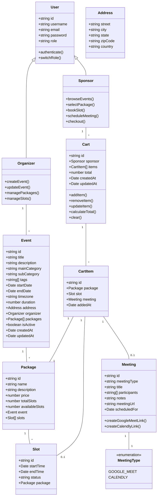
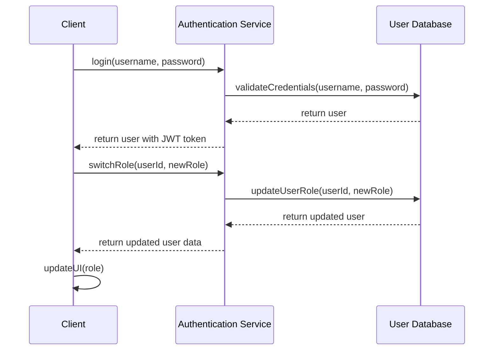
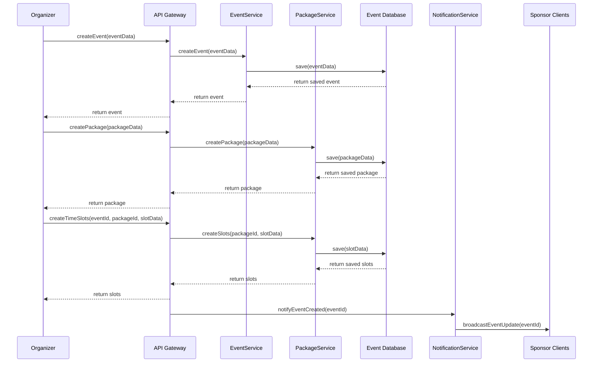
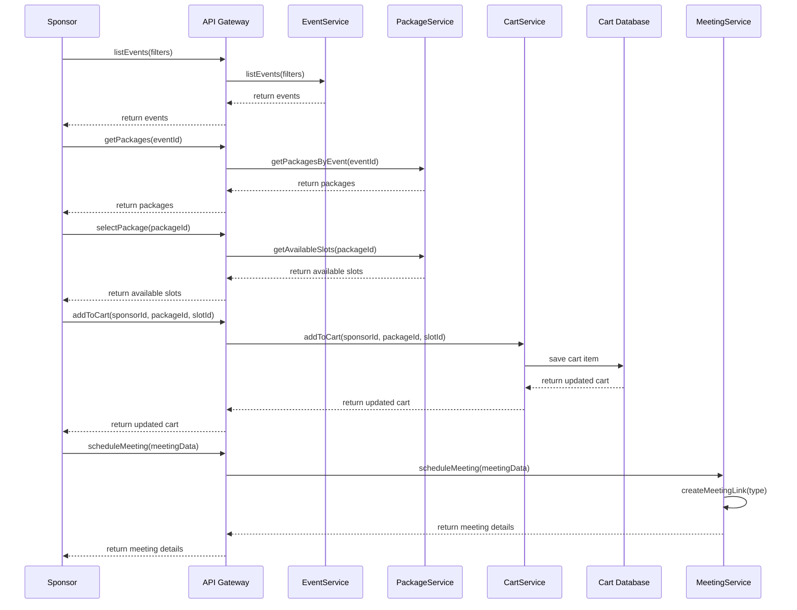
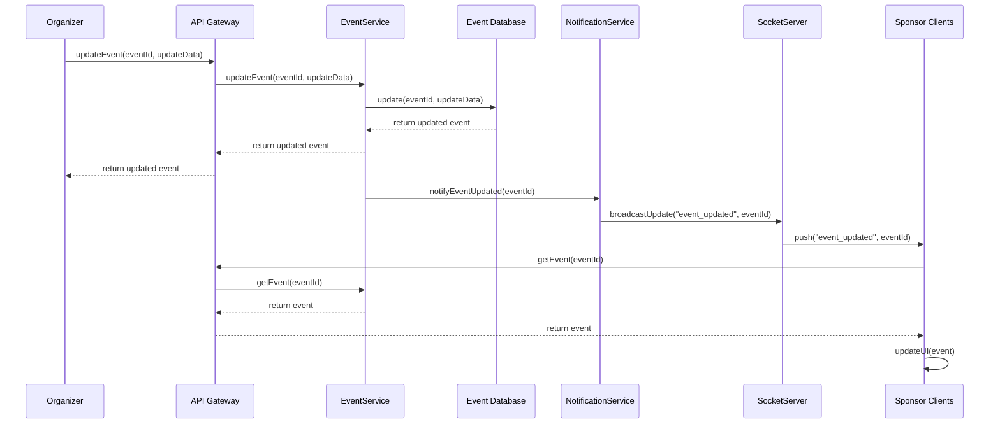

# SponGo Platform System Design

## Implementation Approach

After analyzing the requirements in the PRD, I've identified the following key challenges and implementation approaches:

### Key Challenges

1. **Real-time Data Synchronization**: Ensuring organizer-created events are immediately visible to sponsors with minimal delay (<0.5s)
2. **Dynamic UI Updates**: Managing the shopping cart on the left side and dynamically updating available slots when packages are selected
3. **Role-Based Access**: Implementing a seamless role-switching mechanism between organizer and sponsor views
4. **Meeting Integration**: Integrating with external services (Google Meet, Calendly) for scheduling meetings

### Technology Stack Selection

1. **Frontend**:
   - React with TypeScript for type safety
   - Redux Toolkit for state management
   - Tailwind CSS for responsive design
   - React Query for data fetching and caching
   - Socket.io client for real-time updates

2. **Backend**:
   - Node.js with Express for API server
   - Socket.io for real-time data synchronization
   - MongoDB for database (flexible schema suits event management)
   - Redis for caching and pub/sub mechanism

3. **External Integrations**:
   - Google Calendar API for meeting scheduling
   - Calendly API for advanced scheduling options

4. **DevOps**:
   - Docker for containerization
   - CI/CD pipeline for automated testing and deployment

### Architecture Style

We will implement a microservice-based architecture with the following components:

1. **Authentication Service**: Handles user authentication and role management
2. **Event Service**: Manages event creation, updates, and retrieval
3. **Sponsorship Service**: Handles sponsorship packages and slot management
4. **Meeting Service**: Integrates with external meeting scheduling services
5. **Notification Service**: Manages real-time updates and notifications

This approach allows for independent scaling of services based on load and ensures separation of concerns.

## Data Structures and Interfaces

### Core Entities



### Service Interfaces

#### Authentication Service

```typescript
interface AuthenticationService {
  login(username: string, password: string): Promise<User>;
  logout(userId: string): Promise<void>;
  register(userData: UserRegistrationData): Promise<User>;
  switchRole(userId: string, newRole: string): Promise<User>;
  getCurrentUser(token: string): Promise<User>;
}
```

#### Event Service

```typescript
interface EventService {
  createEvent(eventData: EventCreationData): Promise<Event>;
  getEvent(eventId: string): Promise<Event>;
  updateEvent(eventId: string, eventData: EventUpdateData): Promise<Event>;
  deleteEvent(eventId: string): Promise<void>;
  listEvents(filters?: EventFilters): Promise<Event[]>;
  getEventsByOrganizer(organizerId: string): Promise<Event[]>;
}
```

#### Package Service

```typescript
interface PackageService {
  createPackage(packageData: PackageCreationData): Promise<Package>;
  getPackage(packageId: string): Promise<Package>;
  updatePackage(packageId: string, packageData: PackageUpdateData): Promise<Package>;
  deletePackage(packageId: string): Promise<void>;
  getPackagesByEvent(eventId: string): Promise<Package[]>;
  getAvailableSlots(packageId: string): Promise<Slot[]>;
}
```

#### Cart Service

```typescript
interface CartService {
  getCart(sponsorId: string): Promise<Cart>;
  addToCart(sponsorId: string, packageId: string, slotId?: string): Promise<Cart>;
  removeFromCart(sponsorId: string, cartItemId: string): Promise<Cart>;
  updateCartItem(sponsorId: string, cartItemId: string, updates: CartItemUpdateData): Promise<Cart>;
  clearCart(sponsorId: string): Promise<void>;
}
```

#### Meeting Service

```typescript
interface MeetingService {
  scheduleMeeting(meetingData: MeetingCreationData): Promise<Meeting>;
  getMeeting(meetingId: string): Promise<Meeting>;
  updateMeeting(meetingId: string, meetingData: MeetingUpdateData): Promise<Meeting>;
  cancelMeeting(meetingId: string): Promise<void>;
  createGoogleMeetLink(meetingDetails: MeetingDetails): Promise<string>;
  createCalendlyLink(meetingDetails: MeetingDetails): Promise<string>;
}
```

#### Notification Service

```typescript
interface NotificationService {
  subscribeToEventUpdates(userId: string, eventId: string): Promise<void>;
  unsubscribeFromEventUpdates(userId: string, eventId: string): Promise<void>;
  notifyEventUpdated(eventId: string): Promise<void>;
  notifyPackageUpdated(packageId: string): Promise<void>;
  notifySlotBooked(slotId: string): Promise<void>;
}
```

## Program Call Flow

### User Authentication and Role Switching



### Event Creation by Organizer



### Shopping Experience for Sponsor



### Real-time Event Updates



## Anything UNCLEAR

1. **Data Retention Policy**: The PRD doesn't specify how long historical data (past events, expired packages, completed meetings) should be retained in the system. This information would help in designing appropriate archiving strategies.

2. **Payment Processing**: The PRD mentions prices for packages, but there is no specific mention of payment processing integration. Additional details on payment gateways and workflow would be needed for a complete implementation.

3. **User Management**: The current design assumes basic user registration and authentication. If there are specific requirements around user permissions, team management, or access controls, those would need to be elaborated.

4. **Performance Requirements**: While some performance metrics are mentioned (e.g., synchronization delay < 0.5s), more comprehensive performance expectations for different system components would help in fine-tuning the architecture.

5. **Internationalization**: The UI mockups show a language preference, but there's no specific mention of multi-language support or localization requirements. This could impact both frontend and backend design.

6. **Mobile Support**: The current design focuses on web interfaces. If mobile apps or responsive design for mobile browsers is required, additional specifications would be helpful.

7. **Analytics Requirements**: There's no mention of analytics or reporting needs, which could affect data storage decisions and additional service requirements.