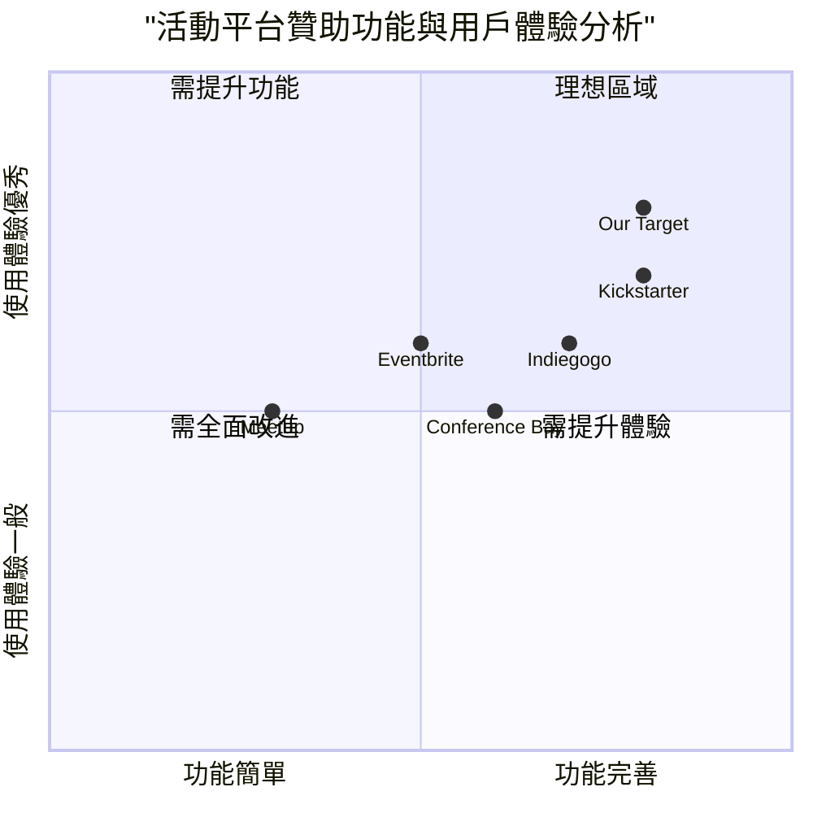
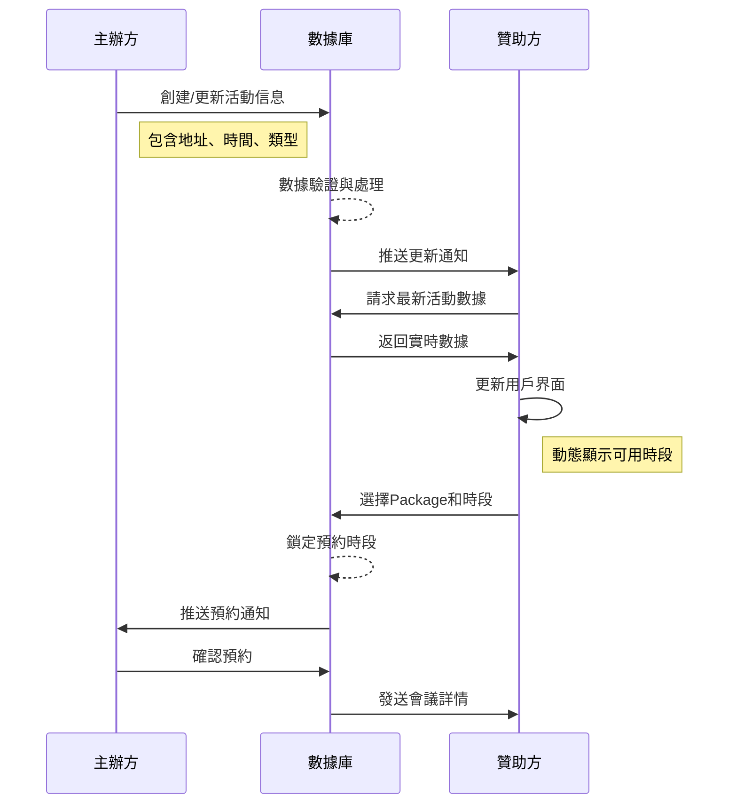

# 主辦方與贊助方平台串接 PRD（2024-03-01 更新版本）

## 1. 項目信息
- 項目名稱：sponsor_plan_integration
- 需求描述：整合主辦方與贊助方平台，確保數據實時同步，優化用戶體驗。
- 更新重點：購物車位置調整、動態時段顯示、平台串接增強、表單擴展與介面美化

## 2. 產品定義

### 2.1 產品目標
1. 確保主辦方與贊助方平台的無縫串接與實時數據更新
2. 提供直覺易用的購物車與會議預約體驗
3. 優化用戶角色切換與登入體驗

### 2.2 用戶故事
1. 作為主辦方，我希望能夠添加詳細的活動信息（地址、時長、類型），以便提供更完整的活動數據
2. 作為贊助方，我希望選擇套餐後能動態看到可用時段，並輕鬆預約會議
3. 作為平台用戶，我希望在登入頁面能有直觀美觀的方式選擇我的角色
4. 作為系統管理員，我希望能夠輕鬆切換角色並驗證平台數據同步狀態

### 2.3 競品分析

主流活動平台功能比較：

1. Eventbrite
   - 優點：清晰的票務購買流程，完善的活動細節設置
   - 缺點：贊助商功能較為基礎，角色切換不直觀

2. Meetup
   - 優點：簡單直觀的活動報名，良好的地址設置
   - 缺點：缺乏完整的贊助功能，會議預約功能有限

3. Kickstarter
   - 優點：完善的贊助機制，精美的用戶界面
   - 缺點：平台使用成本較高，缺乏實時互動功能

4. Indiegogo
   - 優點：靈活的贊助方案，豐富的項目數據欄位
   - 缺點：後台管理複雜，實時更新延遲較高

5. Conference Bay
   - 優點：專業的會議管理，良好的時段選擇功能
   - 缺點：客製化程度不足，角色管理較為僵硬

### 2.4 競品象限圖



## 3. 技術規格

### 3.1 需求分析
1. 前端界面
   - 調整購物車位置至左側並優化顯示邏輯
   - 實現贊助套餐選擇後動態顯示可用時段
   - 設計更具吸引力的登入與角色選擇界面
   - 增強角色切換功能的視覺反饋

2. 後端服務
   - 強化主辦方和贊助方數據實時同步機制
   - 擴展活動信息數據結構（增加地址、時長、類型）
   - 實現動態時段管理的數據邏輯
   - 完善錯誤處理與數據一致性保障機制

### 3.2 需求池（優先級劃分）

P0（必須）：
- 將購物車調整至左側位置
- 實現點擊套餐(Package)後動態顯示可用時段(Available Slots)
- 完善會議預約功能，包括Calendly/Google Meet整合
- 確保主辦方上傳資料後贊助方能實時查看
- 保留並優化Switch Role功能

P1（重要）：
- 擴展主辦方活動申請表單（地址、時長、活動類型）
- 美化登入頁面的角色選擇界面
- 添加數據同步與更新的狀態提示
- 優化購物車與時段選擇的交互體驗

P2（待考慮）：
- 添加活動類型的高級篩選功能
- 實現活動地理位置地圖顯示
- 添加詳細的數據統計分析工具
- 增加批量操作與管理功能

### 3.3 UI 設計草圖

#### 3.3.1 購物車與動態時段
1. 購物車位置調整
   - 移至界面左側（按用戶要求）
   - 改進購物車縮圖設計
   - 優化購物車展開/收起動畫

2. 動態時段顯示
   - 點擊Package後即時更新Available Slots區域
   - 添加時段載入動畫
   - 實現時段選擇的視覺反饋

#### 3.3.2 登入與角色選擇
1. 登入界面美化
   - 設計更視覺化的角色選擇界面
   - 添加角色特性的圖形說明
   - 優化整體色彩與排版風格

2. 角色切換功能
   - 提高Switch Role按鈕的可見性
   - 添加角色切換的過渡動畫
   - 實現角色特定的界面主題

### 3.4 功能詳細說明

#### 3.4.1 主辦方活動申請表單擴展

新增欄位：
1. 詳細地址
   - 街道地址
   - 城市
   - 州/省
   - 郵政編碼
   - 國家/地區

2. 活動時長設置
   - 開始日期與時間
   - 結束日期與時間
   - 時區選擇

3. 活動類型分類
   - 主分類（會議、展覽、研討會等）
   - 子分類（技術、商業、藝術等）
   - 自定義標籤

#### 3.4.2 動態時段管理

實現邏輯：
1. 數據關聯
   - 每個Package關聯特定的可用時段
   - 時段狀態實時更新（可用、已預約、已過期）

2. 交互流程
   - 點擊Package後立即查詢關聯時段
   - 顯示載入動畫（< 0.5秒）
   - 更新Available Slots區域內容

#### 3.4.3 會議預約功能增強

整合選項：
1. Google Meet整合
   - 一鍵創建會議鏈接
   - 自動發送會議邀請郵件
   - 提供日曆(.ics)下載

2. Calendly整合
   - 內嵌Calendly預約界面
   - 同步活動和用戶數據
   - 自定義預約頁面風格

### 3.5 開放問題

1. 技術方面
   - 實時數據同步的最佳實現策略？（WebSocket vs. Polling）
   - 如何保證動態時段顯示的性能？
   - 會議整合API的安全性如何保障？

2. 產品方面
   - 左側購物車是否影響整體頁面佈局？
   - 角色切換後如何保持用戶上下文連續性？
   - 功能擴展是否會增加用戶學習成本？

3. 運營方面
   - 如何衡量新功能的使用效果？
   - 是否需要提供新功能的用戶指南？
   - 如何收集用戶對新界面的反饋？

## 4. 實施計劃

### 4.1 開發階段

1. 階段一（5個工作日）
   - 購物車位置調整至左側
   - 主辦方表單擴展（地址、時長、類型）
   - Switch Role功能優化

2. 階段二（4個工作日）
   - 實現點選Package後動態顯示Available Slots
   - 增強會議預約功能（Calendly/Google Meet整合）
   - 美化登入頁面角色選擇界面

3. 階段三（3個工作日）
   - 平台數據實時同步機制優化
   - 完成整體界面美化
   - 進行全面測試與修復

### 4.2 驗收標準

1. 功能性檢查
   - 購物車正確顯示在左側
   - 點擊Package後Available Slots正確動態更新
   - 主辦方上傳活動後贊助方能實時看到
   - 會議預約功能能成功生成會議鏈接
   - Switch Role功能可正確切換用戶角色

2. 性能指標
   - 頁面載入時間 < 2秒
   - 數據同步延遲 < 0.5秒
   - 動態時段顯示響應時間 < 0.5秒
   - 角色切換完成時間 < 1秒

3. 用戶體驗標準
   - 登入頁面設計滿意度 > 85%
   - 購物車交互流暢度評分 > 4.2/5
   - 會議預約成功率 > 99%
   - 整體界面美觀度評分 > 4.5/5

## 5. 附錄：UI設計與交互原型

### 5.1 購物車左側位置設計

```
+----------------------------------------+
| [用戶名] [Switch Role]                 |
|----------------------------------------|
|        |                               |
| 購     |  活動過濾條件 [ 搜索框 ]       |
| 物     |-------------------------------|   
| 車     |                               |
|        |  活動標題 1                    |
| [0]    |  描述: xxxxxxxxxxxxx           |
|        |                               |
|        |  Package A - $XX [選擇]        |
|        |  Package B - $XX [選擇]        |
|        |                               |
|        |-------------------------------|   
|        |                               |
|        |  Available Slots:             |
|        |  (點選Package後動態顯示)        |
|        |  - 3月10日 10:00-11:00        |
|        |  - 3月11日 14:00-15:00        |
|        |                               |
|        |  [預約會議]                    |
+----------------------------------------+
```

### 5.2 登入頁面角色選擇界面

```
+----------------------------------------+
|         SponGo 平台登入                |
|----------------------------------------|
|                                        |
|  +--------------+  +--------------+    |
|  |    主辦方     |  |    贊助方     |    |
|  |   ORGANIZER   |  |   SPONSOR    |    |
|  |              |  |              |    |
|  |    [圖標]     |  |    [圖標]     |    |
|  |              |  |              |    |
|  | 創建和管理活動 |  | 瀏覽與贊助活動 |    |
|  +--------------+  +--------------+    |
|                                        |
|  請選擇您的角色以繼續                    |
|                                        |
|  用戶名: [                ]            |
|  密碼:   [                ]            |
|                                        |
|          [登入按鈕]                     |
|                                        |
+----------------------------------------+
```

### 5.3 主辦方活動申請表單

```
+----------------------------------------+
| [用戶名] [Switch Role]                 |
|----------------------------------------|
| 創建新活動                              |
|----------------------------------------|
| 基本信息                                |
| 活動名稱: [                ]            |
| 活動描述: [                ]            |
|                                        |
| 活動類型:                              |
| 主分類: [下拉選單           ▼]           |
| 子分類: [下拉選單           ▼]           |
| 自定義標籤: [                ]          |
|                                        |
| 活動時間:                              |
| 開始日期: [日期選擇器      ]             |
| 開始時間: [時間選擇器      ]             |
| 結束日期: [日期選擇器      ]             |
| 結束時間: [時間選擇器      ]             |
| 時區: [下拉選單           ▼]            |
| 活動時長: [自動計算        ] 小時        |
|                                        |
| 活動地點:                              |
| 街道地址: [                ]            |
| 城市: [                ]                |
| 州/省: [                ]               |
| 郵政編碼: [                ]            |
| 國家/地區: [下拉選單        ▼]           |
|                                        |
| [上一步]               [保存並繼續]      |
+----------------------------------------+
```

### 5.4 會議預約功能整合

```
+----------------------------------------+
| [用戶名] [Switch Role]                 |
|----------------------------------------|
| 預約與 [活動名稱] 主辦方的會議           |
|----------------------------------------|
| 您已選擇:                              |
| Package: Premium 贊助方案 - $5,000      |
| 時段: 2024年3月15日 14:00-15:00         |
|                                        |
| 選擇會議方式:                           |
| (O) Google Meet                        |
| ( ) Calendly                           |
|                                        |
| 會議詳情:                              |
| 主題: [Premium 贊助方案討論]             |
| 參與者: [                ]              |
| 備註: [                ]                |
|                                        |
| [取消]                [確認並創建會議]    |
+----------------------------------------+
```

### 5.5 平台數據同步示意圖

