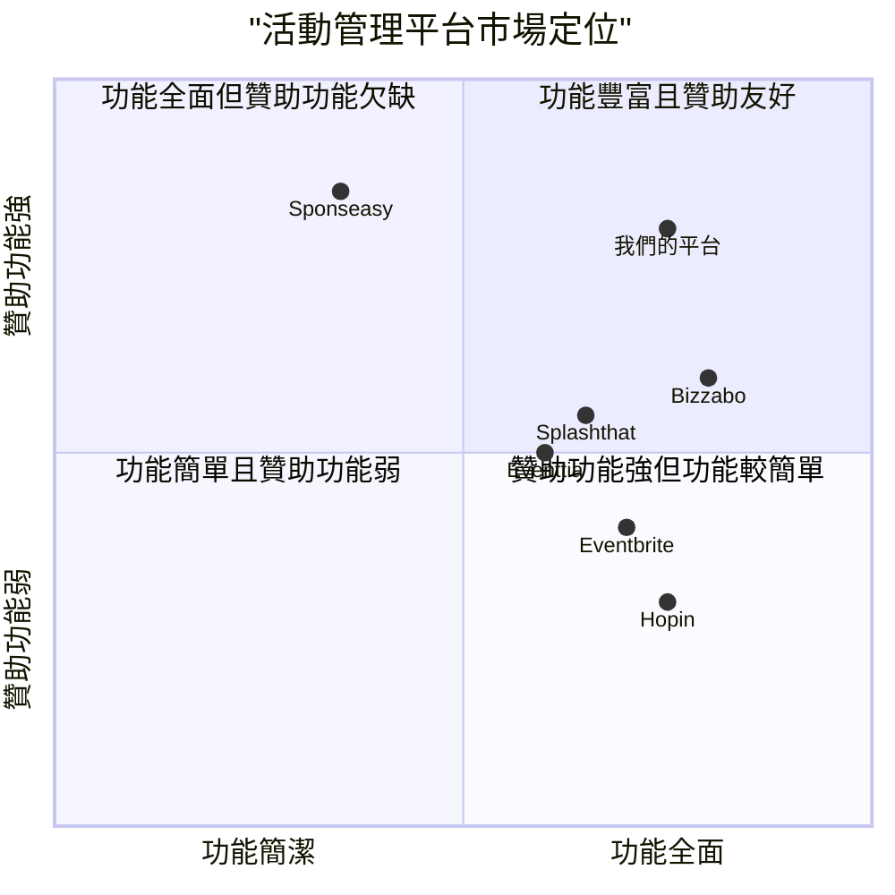

# 活動管理平台 產品需求文件 (PRD)

## 1. 專案資訊

- **專案名稱**：event_management_platform
- **版本**：2.0
- **日期**：2025-03-02

## 2. 需求概述

本產品是一個活動管理平台，旨在連接活動贊助方與主辦方，提供完整的活動發布、瀏覽、贊助管理功能。平台需整合前一版本功能，並確保所有新需求功能順暢運作。

### 原始需求：

1. 贊助方功能：
   - 查閱各個活動方案
   - 購物車功能
   - 會議預約連結

2. 主辦方功能：
   - 提交活動頁面
   - 包含所有細節活動地址
   - 上傳封面照片
   - 上傳活動簡報(deck)

## 3. 產品定義

### 3.1 產品目標

1. **簡化活動贊助流程**：為贊助方提供直觀的活動瀏覽和比較功能，簡化贊助決策過程。

2. **提升活動曝光效率**：為主辦方建立一個全面的平台，以最佳方式展示其活動，增加活動曝光度和贊助機會。

3. **促進贊助方與主辦方互動**：通過提供會議預約和溝通管道，促進雙方有效溝通與合作。

### 3.2 使用者故事

#### 贊助方視角：

1. **作為一個潛在贊助商**，我希望能夠瀏覽不同類別的活動，以便我能找到與我的品牌定位相符的贊助機會。

2. **作為一個贊助決策者**，我需要查看詳細的活動方案資訊，包括受眾分析、曝光機會和價格，以便我能做出明智的贊助決策。

3. **作為一個繁忙的市場經理**，我希望能將感興趣的活動方案加入購物車，以便我可以集中進行比較和決策。

4. **作為一個考慮贊助的企業代表**，我希望能夠輕鬆預約與活動主辦方的會議，以便討論合作細節和可能的客製化方案。

#### 主辦方視角：

1. **作為一個活動策劃者**，我希望能夠創建具有吸引力的活動頁面，以便吸引更多潛在贊助商關注。

2. **作為一個活動營銷人員**，我需要上傳活動簡報和宣傳資料，以便贊助商能全面了解活動價值和贊助回報。

### 3.3 競品分析

| 競品名稱 | 優勢 | 劣勢 |
|---------|------|------|
| **Eventbrite** | 用戶體驗優秀，知名度高 | 贊助功能較弱，主要側重票務銷售 |
| **Sponseasy** | 專注贊助管理，流程完善 | 缺乏整合的活動管理功能，用戶界面較舊 |
| **Splashthat** | 活動頁面設計靈活，整合性強 | 價格較高，贊助功能不突出 |
| **Bizzabo** | 功能全面，數據分析強大 | 學習曲線較陡，小型活動可能過於複雜 |
| **Eventtia** | 客製化程度高，支援多種活動類型 | 缺乏專門的贊助商匹配功能 |
| **Hopin** | 虛擬活動支援出色 | 實體活動功能相對較弱，缺乏贊助整合 |

### 3.4 競品象限圖



## 4. 技術規格

### 4.1 需求分析

本平台需要為贊助方和主辦方提供各自的功能模塊，整合用戶管理、活動管理、贊助管理和溝通系統。同時，平台需要有高質量的UI/UX設計，確保使用者能夠輕鬆上手並高效完成各項操作。

系統需要處理各類資料，包括但不限於：
- 用戶資料（贊助方及主辦方）
- 活動資料（基本信息、詳細描述、地點、時間等）
- 贊助方案資料（價格、回報、限制等）
- 多媒體文件（圖片、簡報等）
- 交易資料（購物車、訂單等）
- 會議預約資料

平台技術架構需要支援：
- 響應式網頁設計，適應不同裝置
- 高效的資料庫管理
- 安全的檔案上傳和存儲功能
- 整合第三方會議系統
- 支付系統整合

### 4.2 需求池

#### P0（必須有）：

##### 贊助方功能：
1. **活動瀏覽系統**
   - 活動分類功能（行業、規模、類型等）
   - 活動搜索功能（關鍵字、日期、地點等）
   - 活動詳情頁面，展示完整活動資訊

2. **方案查閱功能**
   - 查看每個活動的不同贊助方案
   - 方案比較功能
   - 方案詳情展示（價格、曝光機會、權益等）

3. **購物車功能**
   - 添加感興趣的贊助方案
   - 管理購物車內容（增加、刪除、更新數量等）
   - 結帳流程

4. **會議預約系統**
   - 查看主辦方可預約時間
   - 預約會議功能
   - 會議確認和提醒功能

##### 主辦方功能：
1. **活動創建功能**
   - 創建活動基本資訊
   - 設定活動地址、時間、規模等詳細資訊
   - 上傳活動封面照片
   - 設定活動頁面內容

2. **資料上傳功能**
   - 上傳活動簡報(deck)
   - 上傳補充資料
   - 檔案管理功能

3. **贊助方案管理**
   - 創建不同級別贊助方案
   - 設定方案權益和價格
   - 管理方案可見性

#### P1（應該有）：

1. **贊助方儀錶板**
   - 已贊助活動概覽
   - 會議預約日曆
   - 消息通知中心

2. **主辦方儀錶板**
   - 活動管理總覽
   - 贊助狀態追蹤
   - 會議行程表
   - 收入分析

3. **支付系統整合**
   - 多種支付方式
   - 發票自動生成
   - 付款狀態追蹤

4. **互動功能**
   - 主辦方與贊助方即時通訊
   - 問答系統
   - 通知系統

#### P2（可以有）：

1. **數據分析工具**
   - 活動績效分析
   - 贊助回報分析
   - 自訂報表

2. **多語言支援**
   - 繁體中文
   - 簡體中文
   - 英文

3. **行動版應用程式**
   - iOS 應用程式
   - Android 應用程式

4. **API整合功能**
   - 與CRM系統整合
   - 與行銷自動化工具整合
   - 與日曆應用程式整合

### 4.3 UI設計草圖

#### 贊助方視角

**首頁/活動瀏覽頁面**
```
+------------------------------------------------------+
|  Logo   搜尋欄位     活動分類   登入/註冊   購物車    |
+------------------------------------------------------+
|                  熱門活動推薦                        |
|  +--------+  +--------+  +--------+  +--------+     |
|  |活動1   |  |活動2   |  |活動3   |  |活動4   |     |
|  |封面    |  |封面    |  |封面    |  |封面    |     |
|  |        |  |        |  |        |  |        |     |
|  |標題    |  |標題    |  |標題    |  |標題    |     |
|  |日期    |  |日期    |  |日期    |  |日期    |     |
|  +--------+  +--------+  +--------+  +--------+     |
|                                                      |
|                  活動搜尋結果                        |
|  +--------+  +--------+  +--------+  +--------+     |
|  |活動5   |  |活動6   |  |活動7   |  |活動8   |     |
|  |封面    |  |封面    |  |封面    |  |封面    |     |
|  |        |  |        |  |        |  |        |     |
|  |標題    |  |標題    |  |標題    |  |標題    |     |
|  |日期    |  |日期    |  |日期    |  |日期    |     |
|  +--------+  +--------+  +--------+  +--------+     |
|                                                      |
+------------------------------------------------------+
```

**活動詳情頁面**
```
+------------------------------------------------------+
|  Logo   返回     活動分類   登入/註冊   購物車       |
+------------------------------------------------------+
|                                                      |
|  +--------------------------------------------------+|
|  |               活動封面照片                       ||
|  +--------------------------------------------------+|
|                                                      |
|  活動標題                                           |
|  日期：XXXX-XX-XX                                   |
|  地點：XXXXXXXX                                     |
|  主辦方：XXXXXX                                     |
|                                                      |
|  活動描述：                                          |
|  XXXXXXXXXXXXXXXXXXXXXXXXXXXXXXXXXXXXXXXXXXXXX       |
|  XXXXXXXXXXXXXXXXXXXXXXXXXXXXXXXXXXXXXXXXXXXXX       |
|                                                      |
|  贊助方案：                                          |
|  +------------+  +------------+  +------------+      |
|  | 方案A      |  | 方案B      |  | 方案C      |      |
|  | $XXXX      |  | $XXXX      |  | $XXXX      |      |
|  | 權益列表   |  | 權益列表   |  | 權益列表   |      |
|  | 加入購物車 |  | 加入購物車 |  | 加入購物車 |      |
|  +------------+  +------------+  +------------+      |
|                                                      |
|  [預約會議按鈕]              [下載活動簡報按鈕]      |
|                                                      |
+------------------------------------------------------+
```

**購物車頁面**
```
+------------------------------------------------------+
|  Logo   返回                     登入/註冊           |
+------------------------------------------------------+
|                  購物車內容                          |
|  +--------------------------------------------------+|
|  | 活動1 - 方案B                                    ||
|  | 單價：$XXXX                           [移除]     ||
|  +--------------------------------------------------+|
|  | 活動2 - 方案A                                    ||
|  | 單價：$XXXX                           [移除]     ||
|  +--------------------------------------------------+|
|                                                      |
|                                      總計：$XXXX     |
|                                                      |
|                                     [結帳] [繼續瀏覽] |
|                                                      |
+------------------------------------------------------+
```

#### 主辦方視角

**活動創建頁面**
```
+------------------------------------------------------+
|  Logo   儀錶板                     用戶設定          |
+------------------------------------------------------+
|                  創建新活動                          |
|  +--------------------------------------------------+|
|  | 活動基本資訊                                     ||
|  | 活動名稱：[ 輸入框 ]                             ||
|  | 活動日期：[ 日期選擇器 ]                         ||
|  | 活動地點：[ 輸入框 ]                             ||
|  | 活動類型：[ 下拉選單 ]                           ||
|  | 活動描述：                                       ||
|  | [ 多行文字輸入 ]                                 ||
|  |                                                  ||
|  | 上傳封面照片：[ 檔案上傳按鈕 ]                   ||
|  | 上傳活動簡報：[ 檔案上傳按鈕 ]                   ||
|  |                                                  ||
|  | [儲存草稿]                       [下一步：方案設定] ||
|  +--------------------------------------------------+|
|                                                      |
+------------------------------------------------------+
```

**贊助方案設定頁面**
```
+------------------------------------------------------+
|  Logo   儀錶板                     用戶設定          |
+------------------------------------------------------+
|                  設定贊助方案                        |
|  +--------------------------------------------------+|
|  | 方案A                                            ||
|  | 方案名稱：[ 輸入框 ]                             ||
|  | 方案價格：[ 輸入框 ]                             ||
|  | 方案權益：                                       ||
|  | [ ] 權益1 [ ] 權益2 [ ] 權益3 [ ] 自訂權益       ||
|  | 方案描述：[ 多行文字輸入 ]                       ||
|  | [新增方案]                                       ||
|  |                                                  ||
|  | 會議可預約時段：                                 ||
|  | [ 日期選擇器 ] [ 時間選擇器 ] [新增時段]         ||
|  |                                                  ||
|  | [返回編輯活動]                    [發布活動]     ||
|  +--------------------------------------------------+|
|                                                      |
+------------------------------------------------------+
```

### 4.4 開放問題

1. **整合前一版本的具體範圍需要確認**
   - 是否需要遷移舊有資料？
   - 前一版本有哪些功能需要保留或改善？

2. **支付系統的選擇**
   - 是否需要支援多種貨幣？
   - 是否需要整合特定的支付提供商？

3. **會議預約系統的具體實現**
   - 是使用內建會議功能，還是整合第三方會議系統（如Zoom, Google Meet等）？
   - 會議預約需要支援哪些功能（如自動提醒、行事曆同步等）？

4. **檔案上傳的限制**
   - 檔案大小和類型的限制為何？
   - 是否需要提供檔案預覽功能？

5. **安全與隱私考量**
   - 敏感資訊（如財務資料）的處理方式？
   - 隱私政策和用戶資料保護的具體實施？

## 5. 系統整合

### 5.1 與前版本整合要點

1. **用戶系統整合**
   - 確保現有用戶可以無縫使用新功能
   - 保留用戶歷史資料和偏好設定

2. **活動資料庫整合**
   - 將舊版本活動資料遷移至新結構
   - 確保歷史活動仍可正確顯示

3. **UI/UX一致性**
   - 維持品牌視覺一致性
   - 確保使用體驗的平滑過渡

4. **功能兼容性**
   - 確保新舊功能不產生衝突
   - 提供功能更新指南給現有用戶

### 5.2 推出策略

1. **階段性推出**
   - 第一階段：內部測試
   - 第二階段：受邀用戶測試
   - 第三階段：全面推出

2. **用戶培訓**
   - 提供使用指南和教學影片
   - 舉辦線上說明會

3. **回饋機制**
   - 設立問題回報管道
   - 定期蒐集用戶意見

## 6. 總結

本產品需求文件定義了活動管理平台的主要功能和技術規格，旨在為贊助方和主辦方提供一個全面且易用的平台。通過實現本文件中定義的需求，平台將能夠有效連接贊助方和主辦方，簡化活動贊助流程，並提升整體用戶體驗。

在開發過程中，需要優先關注核心功能（P0），確保基本的平台功能能夠穩定運行，然後再逐步實現其他優先級較低的功能。同時，需要特別注意與前一版本的整合，確保平滑過渡。